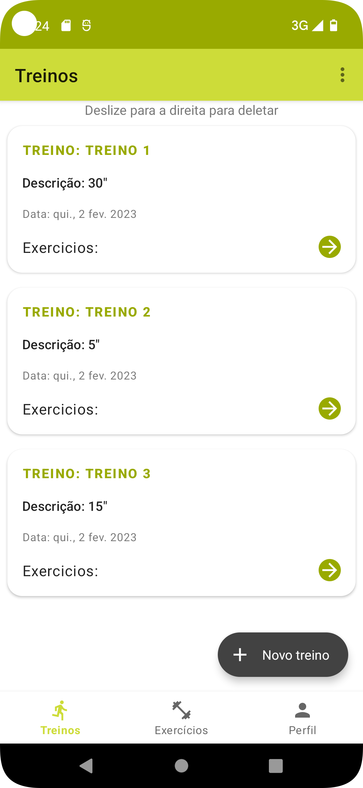
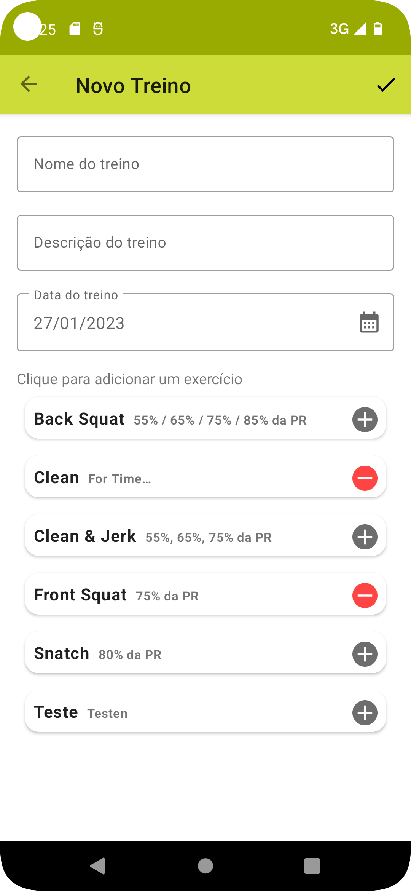
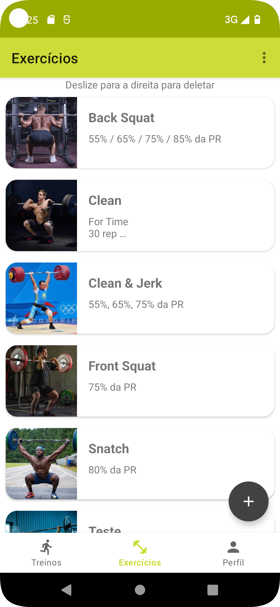
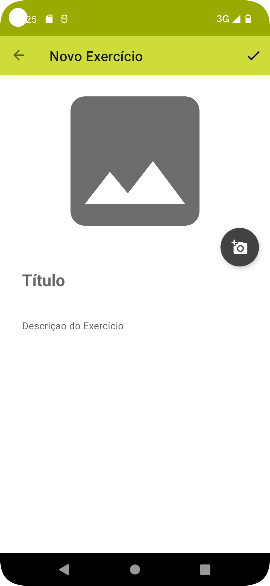

# Total Fit

    

Uma aplicação mobile para gerenciar treinos de musculação.
Permite cadastro e gerencia de exercicios e treinos.

Tecnologias utilizadas:
- Firebase Auth: para autenticação de usuário
- Firebase firestore: para armazenamento dos dados em um BD em nuvem
- Firebase storage: para armazenamento de imagens
- LiveData
- Navigation Component
- ViewModel
